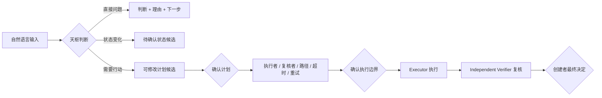

# TianShu Next | 天枢

> 不是另一个聊天机器人，而是一套会理解长期目标、判断项目优先级、受控调度多个 AI Agent，并用独立证据验收结果的个人 AI 工作操作系统。

大多数 AI 助手擅长回答眼前的问题，却不知道你长期在做什么，也无法可靠判断一次执行是否真的成功。天枢试图补上这部分：它持续保存状态和证据，把自然语言转化为判断、候选变化或可确认计划，再让不同 Agent 在明确边界内执行和复核。

天枢的目标不是替你做所有决定，而是让你只处理真正关键的决定。

## 它能做什么

### 告诉你今天最值得推进什么

天枢根据正式项目、当前状态、证据质量、时间窗口和资源压力给出优先级判断。证据不足时，它只追问一个关键问题，不用一串表单打断你。

### 把模糊想法变成可确认的计划

一句自然语言输入可以形成目标、完成标准、范围、非目标、步骤和风险。计划可以修改和版本化；旧版本被替代后不能继续执行。

### 让 Agent 执行，但不让它自己宣布成功

执行者只负责产出。另一个独立 Agent 检查 Git 变化、文件范围、预期内容和结构化证据。即使进程退出码是 0，只要没有产生要求的变化，验收仍然失败。

### 在中断后继续，而不是重新开始

目标、任务、运行、问题、经验和恢复检查点都保存在 SQLite 中。关闭对话、重启 Gateway 或更换模型后，系统可以从正式状态恢复，而不是依赖聊天窗口里的短期上下文。

## 一次真实工作如何流转



这里有三个不可合并的角色：

- **创建者**决定目标、边界和最终是否接受结果。
- **Executor**在批准范围内执行，不能自证完成。
- **Verifier**独立检查证据，不能替创建者做最终决定。

## 与普通 Agent 编排器有什么不同

| 常见做法 | 天枢的做法 |
| --- | --- |
| 输入后立即调用工具 | 先判断输入性质，再生成状态或计划候选 |
| 一次确认后自动执行 | 计划确认与执行边界确认分开 |
| Agent 报告完成即视为成功 | Git、产物、路径和独立复核共同构成证据 |
| 对话上下文就是记忆 | SQLite 是唯一机器状态源 |
| Markdown 或仪表盘可直接改状态 | 它们只是只读镜像，正式变化必须经过 API 和确认 |
| 失败后重新开一轮 | 保存超时、取消、重试、恢复和问题台账 |
| 用关键词猜测项目 | 只匹配已登记项目，受保护项目默认不可访问 |

## 适合谁

- 同时推进多个长期项目，希望 AI 不只回答问题，还能保持连续判断的人。
- 使用 Codex、Claude Code、Hermes、OpenClaw 等多个 Agent，需要统一治理和验收的人。
- 重视权限边界、过程证据、失败恢复和最终人工控制的个人开发者或小团队。

天枢目前不适合希望“安装后立即无人值守接管所有业务”的用户。它仍处于真实任务与持续运行试点阶段，也不会绕过人工确认直接写入未授权项目。

## 当前进展

截至 2026-07-15：

- P1-P4 的身份状态、变化理解、项目判断和运行治理基础已具备。
- P5 的统一 Agent 调度、超时、取消、重试、恢复和独立复核机制已实现。
- Claude Code、Hermes、Codex 和 OpenClaw 已接入统一 Registry/Dispatcher。
- 跨会话连续性、Git 项目变化感知、SSE 推送和统一知识索引已经落地。
- 本地完整自动化测试 **89/89 通过**。
- 正式服务健康检查为 `status=ok`，机器状态源为 SQLite。

工程控制平面约完成 85%；完整终端产品约完成 70%-75%。真实代码任务的重复稳定验证、AgentHub 完整呈现、飞书/日历/会议事件接入和长期连续试点仍未完成。

查看可审计进展：[当前进展基线](docs/TIANSHU_CURRENT_PROGRESS_20260715.md) · [产品路线](docs/TIANSHU_PRODUCT_ROADMAP_003.md) · [系统结构图](docs/TIANSHU_SYSTEM_VISUAL_MAP_001.md)

## 快速运行

要求 Node.js 22.5 或更高版本。

```powershell
git clone https://github.com/liaoj0330-bot/tianshu-next-.git
cd tianshu-next-
npm test
npm run service
```

服务默认提供统一 Gateway。启动后可检查：

```powershell
Invoke-RestMethod http://127.0.0.1:4317/health
Invoke-RestMethod http://127.0.0.1:4317/v1/today
```

核心接口包括：

- `POST /v1/intake`：统一自然语言入口。
- `GET /v1/today`：今日重点、变化、待确认项和运行摘要。
- `GET /v1/confirmations`：需要创建者决定的状态、计划和运行结果。
- `POST /v1/plan-candidates/:id/revise`：创建计划的新版本。
- `POST /v1/intakes/:id/plan-decision`：确认计划，但不启动 Agent。
- `POST /v1/plans/:id/execution-boundary`：配置执行隔离边界。
- `POST /v1/plans/:id/execution-decision`：确认执行边界。

## 可信边界

- SQLite 是唯一机器状态源；Markdown 和 Obsidian 只做说明、证据报告或只读镜像。
- 用户输入不会未经确认直接触发受控执行。
- Executor 不能验证自己的结果，也不能宣布目标完成。
- 退出码为 0 不等于成功。
- 未登记项目不做猜测；`no_access` 项目即使命中名称也会 fail closed。
- Teacher PPT、069、070 及业务项目仓库属于本仓库禁止访问范围。
- 隔离样本通过不等于生产产品已经完成。

## 深入了解

- [产品概览](docs/PRODUCT_OVERVIEW.md)
- [产品闭环与 P5 状态](docs/TIANSHU_PRODUCT_LOOP_P5_STATUS_002.md)
- [跨会话连续性](docs/TIANSHU_CONTINUITY_EVOLUTION_REPORT_001.md)
- [统一知识索引](docs/TIANSHU_UNIFIED_INDEX_LAYER_001.md)
- [实时项目变化治理](docs/TIANSHU_PROJECT_CHANGE_REALTIME_001.md)
- [P5 生命周期证据](docs/TIANSHU_P5_LIFECYCLE_EVIDENCE_002.md)
- [AgentHub 接入验收](docs/TIANSHU_GATEWAY_AGENTHUB_ACCEPTANCE_001.md)

## 项目状态

TianShu Next 当前版本为 `0.1.0`，仍是私人开发中的实验性产品。仓库尚未声明开源许可证；在许可证明确前，请勿将代码可见性理解为已授予复制、修改或分发权利。
