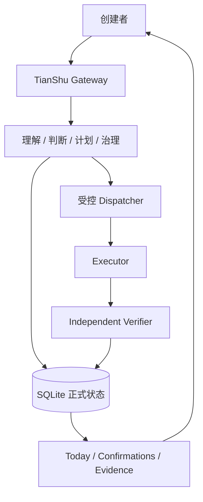

# 天枢产品概览

## 一句话介绍

天枢是一套个人 AI 工作操作系统：它理解长期目标和当前变化，帮助创建者判断项目、形成计划、受控调度多个 Agent，并以独立证据验收结果。

## 为什么需要天枢

今天的 AI 工具通常拥有很强的单次执行能力，但长期工作仍有几个断点：

1. 它知道当前提示词，却不知道长期身份、项目组合和历史决定。
2. 它可以执行任务，却容易把“命令运行结束”误认为“目标已经完成”。
3. 它可以调用多个 Agent，却缺少清楚的权限、复核和最终责任边界。
4. 对话一旦中断，问题、证据和下一步经常散落在不同窗口中。
5. 自动化越强，错误写入、越界修改和错误完成声明的代价越高。

天枢不是通过增加一个更大的聊天框解决这些问题，而是建立一条长期、可恢复、可审计的工作链路。

## 核心产品承诺

### 理解，而不是只分类

面对自然语言输入，天枢需要返回可使用的判断：结论、理由、不确定性、证据和下一步。证据不足时，只提出一个最关键的问题。

### 建议，而不是偷偷执行

状态变化先成为候选；行动意图先成为计划。创建者可以接受、修正或拒绝，而不是在 Agent 已经修改项目后才发现理解有误。

### 执行与证明分离

Executor 负责执行，Verifier 负责复核，创建者负责最终接受。三者的权力不可互相替代。

### 记住事实，也记住失败

天枢保存的不只是成功结果，还包括卡点、失败原因、恢复方式、复发次数和待确认经验。长期连续性来自 SQLite 中的正式状态，而不是一段越来越长的聊天记录。

### 自动化必须有边界

每次受控执行都需要明确执行者、复核者、允许路径、超时和重试次数。受保护项目默认不可搜索、不可读取、不可执行。

## 四个典型场景

### 场景一：今天应该推进什么

创建者问：“根据我当前正式项目和状态，今天最值得优先推进什么？”

天枢读取项目优先级、近期变化、证据质量和资源压力，返回一个判断、理由和唯一下一步。它不会因为出现某个行业关键词就凭空创建项目。

### 场景二：把想法变成计划

创建者说：“把这个功能做出来。”

天枢先整理目标、完成标准、范围、非目标、步骤和风险。如果材料不足，它先追问；如果计划被修改，则产生新版本并使旧版本失效。

### 场景三：让多个 Agent 安全协作

创建者确认计划后，再单独确认谁执行、谁复核、允许修改哪些路径，以及超时和重试边界。Executor 的输出只是证据之一，Verifier 必须独立检查结果。

### 场景四：中断后继续工作

服务或会话重启后，天枢从 SQLite 恢复当前检查点、未解决问题、待确认事项和活动任务，并明确给出恢复指令，避免重新规划已完成工作。

## 产品结构

## 天枢不是什么

- 不是一个换皮聊天页面。
- 不是收到指令就无限制执行的自动化机器人。
- 不是用 Markdown 文件冒充数据库的知识库。
- 不是仅凭 Agent 自述就宣布成功的任务管理器。
- 不是已经完成长期生产验证的成熟商业产品。

## 当前成熟度

截至 2026-07-15，天枢的工程控制平面约完成 85%，完整终端产品约完成 70%-75%。完整自动化测试为 89/89 通过，统一调度、独立复核、运行治理、连续性、项目变化感知和知识索引均已有可执行证据。

当前主门槛不是继续堆叠功能，而是完成真实代码任务的重复稳定验证、完整交互呈现、外部事件接入和长期连续试点。

## 对外表达原则

天枢只声明已经有代码、运行结果和独立证据支持的能力。测试样本不能写成真实业务完成，本地提交不能写成远端已同步，Executor 的成功输出不能写成目标完成。

这不是文案上的保守，而是产品本身的核心价值：AI 可以主动工作，但每一个重要结论都必须有边界、有证据、可恢复、可追责。
