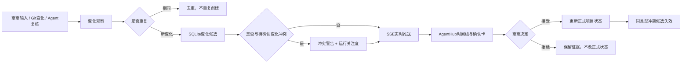
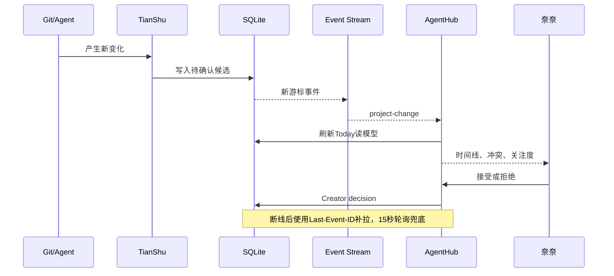

# 天枢项目变化感知与实时可视化

> 当前完成的是可执行机制与自动测试验收；正式服务重启和真实项目运行态推送仍需继续验收。

## 真实闭环

## 状态分层

| 层级 | 含义 | 谁能改变 |
| --- | --- | --- |
| 观察 | Git、Agent或用户产生的新信号 | 系统自动记录 |
| 候选 | 已归属项目但尚未确认 | 系统生成 |
| 正式状态 | 项目当前阶段、进展、风险、截止等 | 奈奈接受后写入 |
| 战略优先级 | 长期项目排序 | 不被运行变化自动篡改 |
| 运行关注度 | 近期风险、冲突和待确认压力 | 系统按证据计算 |

## 实时与恢复

## 已验收

- TianShu完整自动测试：86/86。
- 冲突、去重、SSE、断线补拉和受保护项目隔离均有可执行测试。
- AgentHub类型检查和生产构建通过。
- SQLite是唯一机器状态源，Obsidian仅为可读镜像。
- Executor和Verifier都不能替代奈奈确认正式项目变化。

## 尚未完成

- 正式服务需要重启到最新代码。
- 正式SQLite需要登记真实项目白名单，首次扫描只建立基线。
- 需要完成一次AgentHub运行态Git变化实时推送验收。
- 飞书任务、日历和会议事件尚未接入。
- 长期连续试点尚未完成。