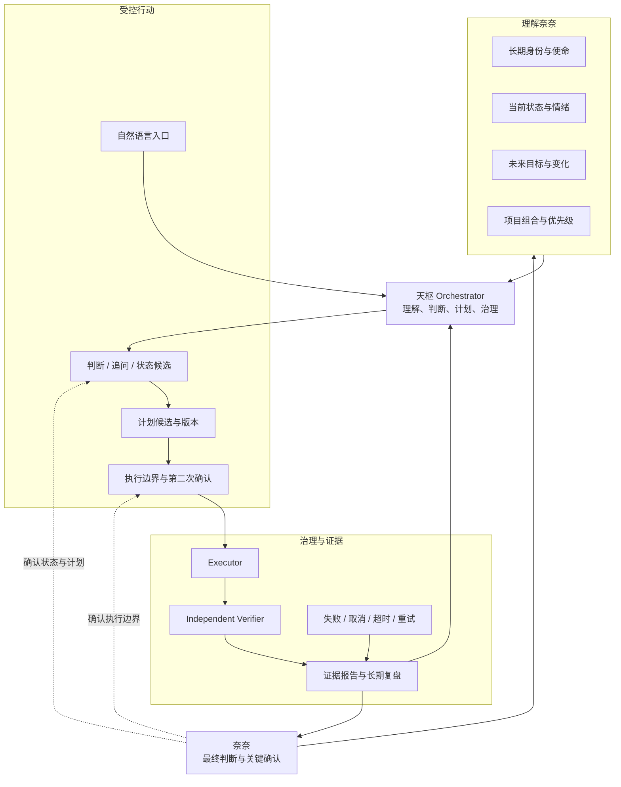
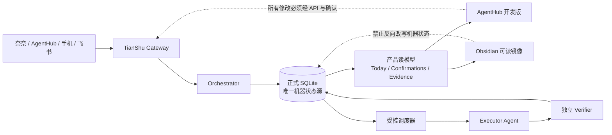
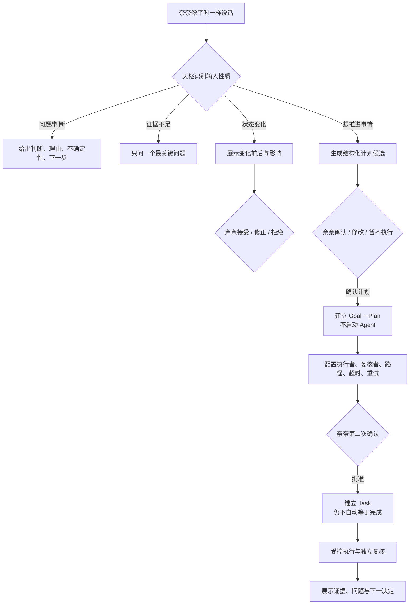
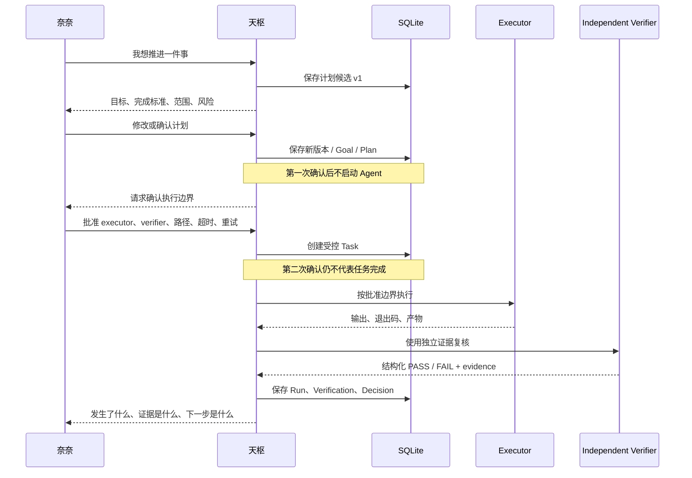
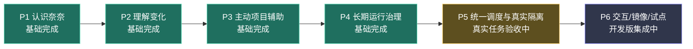

# 天枢结构关系图

> [!important] 一句话定位
> 天枢是奈奈的个人 AI 工作操作系统：理解长期身份与阶段变化，主动判断项目，受控调度多个 Agent，独立验收，长期运行，并把关键决定交给奈奈确认。

## 1. 产品认知结构

## 2. 状态权威与界面关系

> [!warning] 权威规则
> SQLite 是唯一机器状态源。Obsidian 是汇报、理解和复盘界面；不能用手工修改 Markdown 直接改变任务、运行或审批状态。

## 3. 奈奈的真实用户路径

## 4. 双确认与独立验收

## 5. 六阶段能力地图

## 6. 结构层级

| 层级 | 作用 | 当前载体 |
| --- | --- | --- |
| 创造者模型层 | 身份、使命、目标、偏好、边界 | `00_创造者模型` + SQLite 状态快照 |
| 判断与项目层 | 判断资产、项目组合、量化优先级 | SQLite + `04_判断资产卡库` |
| 产品交互层 | 今日重点、追问、候选、确认 | AgentHub TianShu Today |
| 计划治理层 | Goal、Plan、版本、双确认 | TianShu Orchestrator |
| 执行验收层 | Executor、Verifier、证据与终态 | 受控调度器 + SQLite |
| 汇报镜像层 | 进度、结构图、复盘、导航 | 本 Obsidian Vault |

## 7. 防污染与停止规则

- 上层已确认事实优先于历史材料和模型推断。
- 未确认变化只能作为候选，不能直接成为正式状态。
- 未登记项目不猜测；`no_access` 项目即使命中也禁止执行。
- Executor 退出码成功不能替代 Git、产物、范围与独立复核证据。
- 样本验证不能写成产品完成。
- 受保护项目保持隔离，不读取、不修改、不派发。

## 8. 汇报入口

- [[06_项目记忆层/02_天枢个人智能操作系统/TIANSHU_NEXT_CURRENT_PROGRESS_001|天枢当前进度与证据仪表板]]
- [[06_项目记忆层/02_天枢个人智能操作系统/项目记忆首页|天枢项目记忆首页]]
- [[00_从这里开始_天枢工作台|返回天枢工作台]]