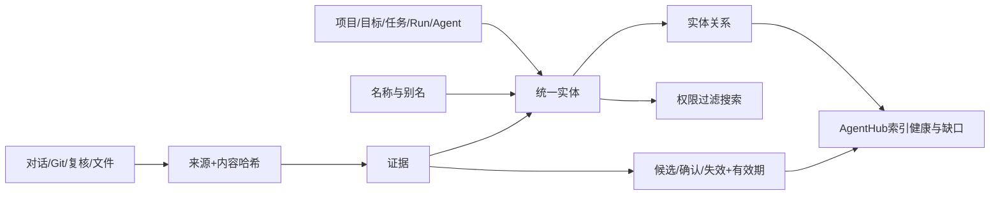

# 天枢统一索引层

## 定位

索引层是天枢的神经连接层，负责定位、关联和追溯；它不替代SQLite正式状态，也不能自行确认项目事实。

## 已实现

- 统一实体ID：project、goal、plan、task、run、agent。
- 别名与规范名称索引。
- 来源类型、引用、内容SHA-256和观察时间。
- 证据候选、已确认、已拒绝、已替代状态。
- valid_from/valid_to时间有效性。
- Goal→Plan→Task→Run及reviewed_by关系。
- 受保护实体默认不进入搜索结果。
- 实体详情、双向关系、来源证据和覆盖率API。
- Git观察只保留最新待确认快照，旧快照转历史，不再堆满确认区。

## 正式运行数据

| 指标 | 当前值 |
| --- | ---: |
| 实体 | 14 |
| 别名 | 19 |
| 来源 | 11 |
| 证据 | 11 |
| 关系 | 6 |
| 别名覆盖率 | 100% |
| 证据覆盖率 | 17% |
| 受保护实体 | 2 |
| 当前证据冲突 | 0 |

证据覆盖率17%是真实缺口，不应为了让仪表盘好看而伪造证据。下一步应为高校AI教育体系、自媒体IP、目标、任务和Agent补充真实来源。

## 权限原则

- protected实体可以计数，但默认搜索不可见。
- 搜索命中不等于有权读取原文。
- 索引失败不阻断正式事实写入，可从SQLite事实重建。
- 未确认项目变化只生成candidate证据。
- 奈奈接受后才转为confirmed。